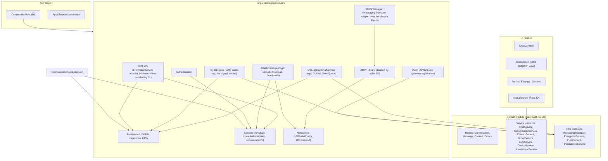
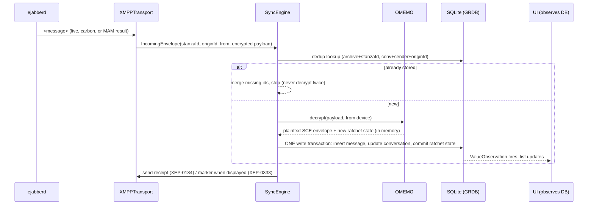
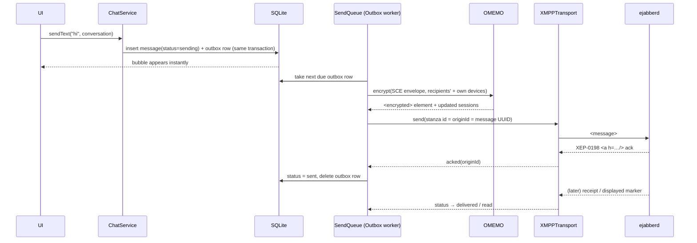

# 01 — System Architecture

## 1. Overview

```
 iPhone app (Swift)                         Server (Docker Compose, one host for MVP)
┌──────────────────────────────┐          ┌───────────────────────────────────────────────┐
│ UI (SwiftUI + UIKit chat)    │          │ Caddy (443)  ── upload.example.com ──┐         │
│ Domain services              │  TLS     │                                       ▼         │
│ Messaging / Sync / OMEMO     │◄────────►│ ejabberd  chat.example.com (5223 direct TLS)   │
│ Persistence (SQLite/GRDB)    │  5223    │   ├─ MAM, MUC(+MUC/Sub), PEP, SM, Carbons      │
│ Attachments (AES-GCM)        │  HTTPS   │   ├─ mod_http_upload (internal :5443)          │
│ Push (APNs token mgmt)       │◄────────►│   └─ mod_push ──XEP-0114──► push-gateway (Go)  │
│ Notification Service Ext.    │          │                                  │             │
└──────────────▲───────────────┘          │ PostgreSQL 17 (ejabberd + gateway DBs)         │
               │ APNs                     └──────────────────────────────────┼─────────────┘
               └──────────────── Apple Push Notification service ◄───────────┘
```

Principles:

- **Local database is the UI's source of truth.** The network only feeds the database.
- **XMPP is invisible.** The UI talks to domain services (`ChatService.send(...)`), never to stanzas.
- **Every external dependency sits behind a protocol**: `MessagingTransport`,
  `EncryptionService`, `PushService`, `AttachmentService`, `PersistenceService`.
- **Plaintext exists only on the device**, in memory and in the local database (iOS Data Protection).
- **Reliability before features.** An operation is shown as complete only after it is persisted
  locally. Network operations are idempotent and retried from a persistent outbox.

## 2. Component diagram



Dependency rules (enforced by SwiftPM target dependencies):

| Module | May depend on | Must not depend on |
|--------|---------------|--------------------|
| UI | Domain | anything XMPP, OMEMO, GRDB |
| Domain | Foundation only | everything else |
| Messaging, SyncEngine | Domain, Persistence | concrete XMPP or OMEMO types (they use protocols only) |
| XMPPTransport | the chosen XMPP library, Domain (transport protocol + value types) | UI, Persistence, OMEMO |

The XMPP library and the OMEMO implementation are **open decisions (D3/D4)**, decided by spike S1.
Only the adapter modules `XMPPTransport` and `OMEMO` may import them.
| OMEMO | Security, Domain (`EncryptionService`), a crypto-store protocol | UI, XMPP types |
| Persistence | Domain, GRDB | XMPP, OMEMO internals |

Two abstraction levels exist on purpose:

- `MessagingTransport` is **protocol-semantic** but library-neutral. Examples:
  `send(_ envelope: OutgoingEnvelope)`, `queryArchive(_:after:)`, `publish(node:item:)`,
  `fetchItems(node:of:)`, `joinRoom`, `setAffiliation`, `uploadSlot(for:)`.
  It uses our own value types (`JID`, `ArchivedMessage`, `IncomingEnvelope`), never library types.
  Replacing the XMPP library means re-implementing only `XMPPTransport`.
- Domain services are **product-semantic**: `ChatService.sendText(_:in:replyTo:)`,
  `ChatService.react(_:to:)`, `GroupService.removeMember(_:from:)`.

## 3. Data flow

### 3.1 Incoming message



### 3.2 Outgoing message



## 4. Runtime model and concurrency

- Swift 6 strict concurrency. Each subsystem with mutable state is an `actor`:
  `XMPPConnection`, `SyncEngine`, `OMEMOStore`, `SendQueue`, `AttachmentTransferManager`.
- One GRDB `DatabasePool` (WAL mode) in the App Group container. Writes are serialized by GRDB.
  The UI reads through `ValueObservation`.
- Decryption is serialized per (peer JID, device) so the ratchet state never forks.
- The NSE **does not** touch OMEMO state or open an XMPP connection in the MVP. It only reads
  contact names from the shared DB (read-only) and the push key from the shared Keychain group.
  This removes the most dangerous cross-process race: two processes advancing the same ratchet.

## 5. Repository structure

```
/ios
  project.yml                    XcodeGen spec (app + NSE + test targets)
  Config/                        Development.xcconfig, Staging.xcconfig, Production.xcconfig
  App/                           @main, CompositionRoot, AppLifecycleCoordinator, Info.plist
  NotificationService/           UNNotificationServiceExtension
  Packages/MessengerKit/         local SwiftPM package
    Package.swift
    Sources/
      Domain/  Persistence/  XMPPTransport/  OMEMO/  SyncEngine/
      Messaging/  Attachments/  Push/  Authentication/  Security/  Networking/
      DesignSystem/  UI/
    Tests/
      DomainTests/  PersistenceTests/ (incl. migrations)  XMPPTransportTests/
      OMEMOTests/ (vectors, interop)  SyncEngineTests/  MessagingTests/  AttachmentsTests/
  IntegrationTests/              runs against a staging/dev ejabberd
/server
  ejabberd/ejabberd.yml.template
  ejabberd/README.md
  postgres/init/                 role/DB creation scripts (no secrets)
/push                            Go push gateway (XEP-0114 component → APNs)
  cmd/push-gateway/  internal/  migrations/  Dockerfile
/deploy
  docker-compose.yml
  docker-compose.dev.yml         local dev overrides (self-signed / local CA)
  Caddyfile
  .env.example                   placeholders only; real .env is never committed
/docs                            this documentation + ADRs + runbooks
/scripts
  admin.sh                       create/disable/delete/reset/list accounts (wraps ejabberdctl)
  backup.sh  restore.sh
/spikes                          S1–S4 spike code (throwaway; results go to docs/spikes/)
/tools/omemo-oracle              python-omemo/twomemo harness for OMEMO interop tests (CI)
```

Configuration and environments:

- iOS: `ServerConfig` is read from the build configuration (`Development` / `Staging` / `Production`
  xcconfig → Info.plist keys): `xmppDomain`, `xmppHost`, `xmppPort`, `pushComponentJID`,
  `mucDomain`. The upload service is discovered via disco (XEP-0030), so it is not hardcoded.
  No hostname appears in Swift source code.
- Server: `.env` per environment (`deploy/.env.example` documents every variable). Secrets
  (DB passwords, APNs `.p8` key, component secret) are mounted from files outside the repository.
- `.gitignore` blocks `.env`, `*.p8`, `*.pem`, `*.key`, `secrets/`.

## 6. UI architecture notes

- SwiftUI for navigation, chat list, profile, settings, lock screen, group info.
- **The chat message list and composer are in UIKit** (`UICollectionView` with diffable data
  source and a growing `UITextView`), wrapped in `UIViewControllerRepresentable`.
  - Alternative: SwiftUI `ScrollView` + `LazyVStack` with the iOS 18 `scrollPosition` APIs.
  - Why UIKit: keeping the scroll position stable while older pages are prepended,
    interactive keyboard dismissal, swipe-to-reply, context menus with previews, and steady 120 Hz
    scrolling across thousands of cells are still more predictable in UIKit.
- View models are `@Observable` and `@MainActor`. They hold domain models only.
- Error presentation: domain errors map to short user strings ("Unable to connect. Try again.").
  Technical detail goes only to `os.Logger` with `.private` interpolation.
- The connection state appears in the navigation title, Telegram-style: "Connecting…",
  "Updating…". There are no modal errors for transient network problems.
