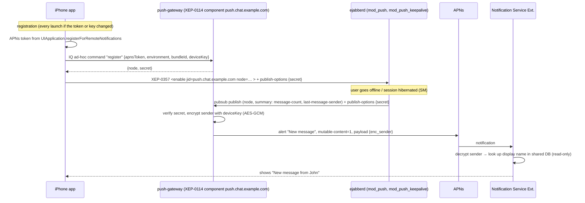

# 04 — Push Architecture

## 1. Design

- **The gateway is a separate service behind a generic interface.** The iOS side uses `PushService`
  (`register(token:)`, `unregister()`, `setMuted(_:)`). Only `XMPPPushRegistrar` knows about XEP-0357.
  The gateway can be replaced (e.g. by `p2` or a hosted service) without changing app logic.
- Registration goes over the user's **authenticated XMPP session** (the gateway trusts the `from` JID
  stamped by ejabberd). No separate HTTP auth is needed.
- The gateway is stateful and small (Go, PostgreSQL table `registration(node PK, account_jid, apns_token,
  environment, device_key_enc, created_at, last_success_at)`). APNs uses token-based auth (`.p8` key
  mounted as a secret).

## 2. Payload privacy

| Field | Who sees it | Content |
|-------|-------------|---------|
| ejabberd → gateway | our server | sender JID, message count. **No body** (`include_body: false`, `include_sender: true`) |
| gateway → APNs → device | Apple | generic `alert.body = "New message"`, `mutable-content: 1`, `thread-id` = HMAC(conversation) and `enc_sender` (AES-GCM under deviceKey) |
| NSE → screen | user | "John Smith" + "New message" |

- The plaintext message text is **never** in a push. Showing message text in notifications would require the
  NSE to connect to XMPP and decrypt OMEMO in a second process (the approach Monal/Siskin use). That
  is postponed: it needs cross-process ratchet locking, and the NSE limits (time budget ~30 s, small
  memory budget) make it a reliability risk. It is listed as a future option.
- Compromise documented: our own server and gateway see *who messaged whom and when* (metadata). Apple sees
  only timing and device token.
- If NSE decryption fails (e.g. the device is locked before first unlock), the generic "New message" is shown.

## 3. Groups and offline delivery

- Plain MUC delivers group messages only to occupants that are "joined". When an iOS client's session
  expires, it would get **no push for group messages**. This is a known XMPP limitation.
- Chosen: **ejabberd MUC/Sub** (`allow_subscription: true` on rooms). Members subscribe to the
  room's message events once, so messages reach their bare JID even when offline. This triggers
  `mod_push` and lands in their own MAM (`user_mucsub_from_muc_archive`).
  - Alternative: MIX (XEP-0369). Rejected: experimental, limited server/client support.
  - Alternative: rely on a long SM hibernation only. Rejected: fails after the resume timeout or a server restart.
  - Trade-off: MUC/Sub is ejabberd-specific (documented, not an XSF standard). It sits behind
    `GroupService`/`MessagingTransport`, so changing it later is contained.
  - **Verify in the Phase 8 spike** that MUC/Sub events with OMEMO payloads trigger `mod_push` as expected.
- `mod_push_keepalive`: `resume_timeout` 72 h, `wake_on_timeout: true`. Before the hibernated
  session expires, the server sends a silent wake push so the client can reconnect.

## 4. APNs token lifecycle

| Event | Action |
|-------|--------|
| First launch after login | request notification permission (after the first chat screen, not at login); register |
| `didRegisterForRemoteNotificationsWithDeviceToken` | compare with the stored token hash; if changed → re-register with the gateway, re-`enable` on the server |
| Every app start | re-`enable` (idempotent; heals server-side state loss) |
| APNs 410 Unregistered / 400 BadDeviceToken | gateway deletes the registration and returns an error to ejabberd, so `mod_push` disables that node |
| Logout | `disable` on the server, `unregister` on the gateway, delete deviceKey from the Keychain |
| Account disabled/deleted (admin) | `admin.sh` also purges the account's gateway registrations |
| Environment | the gateway uses the sandbox endpoint for Development builds and production for TestFlight/App Store, from the registration's `environment` |

## 5. Mute

- Mute is stored locally and also sent to the gateway (`setMuted(conversationHash, until)`). The gateway
  then sends **no** APNs for muted conversations (it knows the sender/room JID from ejabberd).
  - Alternative: suppress in the NSE. Rejected: that requires the restricted
    `com.apple.developer.usernotifications.filtering` entitlement.

## 6. Failure handling and observability

- Gateway logs: registration count, APNs status codes per minute, 410 cleanups, latency. **No** JIDs
  in info-level logs (hashed), never payloads.
- Health endpoint `/healthz` (internal network) for the Docker healthcheck.
- If push delivery fails, the content is not lost: messages remain in MAM/offline storage and arrive at
  the next app open.
